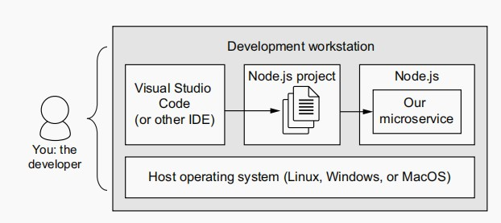
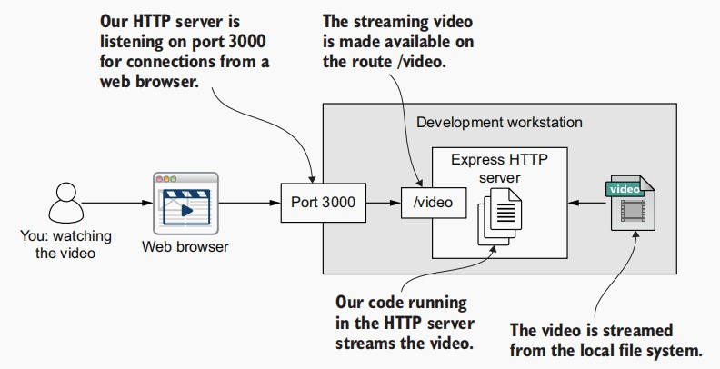

# Creating your first microservice


Our single-service development environment for chapter 2

## Building an HTTP server for video streaming
Our microservice delivers streaming video to the web browser via port 3000 and the route video.
We can watch the video directly through our browser by pointing it at http://localhost:3000/video.

To create our microservice, we must go through the following steps:
1. Create a Node.js project for our microservice.
2. Install Express and create a simple HTTP server.
3. Add an HTTP GET route /video that retrieves the streaming video.

### Creating a Node.js project
Before we can start writing code, we need a Node.js project where our code can live. This is a basic Node.js project with a single entry point: the script file `index.js`. You can also see `package.json` and `packagelock.json`, which are the files that track the dependencies and metadata for our project. The dependencies themselves are installed under the `node_modules` directory
```
├── index.js
├── node_modules
├── package-lock.json
└── package.json
```

###  Installing Express
To stream video from our microservice, we’ll make it an HTTP server (also known as a web server). That is to say that it will respond to HTTP requests from a browser, in this case, a browser’s request to play streaming video. To implement our HTTP server, we’ll use **Express**.

>  The package file with Express installed (chapter-2/example-1/package.json)
```
{
  "name": "example-1",
  "version": "1.0.0",
  "description": "",
  "main": "index.js",
  "scripts": {
    "start": "node index.js"
  },
  "keywords": [],
  "author": "",
  "license": "MIT",
  "dependencies": {
    "express": "^5.0.0-beta.1" //  the express package
  }
}
```

Now change the directory into the particular example that you want to get running.
```
cd example-1
npm install
```

Running our simple web server

```
cd example-1
npm start
>> First example app listening on port 3000, point your browser at http://localhost:3000

curl http://localhost:3000
>> Hello World!
```

### Adding streaming video
We only had a single HTTP route handler that returned Hello World.
Now we’ll change this and create a REST API for streaming video to the browser.

Often routes in REST APIs return data, but we’ll add a new route that returns
streaming video. You can see what it looks like in figure below. The diagram shows how our HTTP server will read the video from the filesystem and deliver it to the web browser via port 3000 and the video route.



We set up this pipeline for video streaming and then let Node.js and Express
take care of the rest. Node.js and Express make this easy! To run this code, first
change to the example-2 subdirectory:
```
cd example-2
npm install
node index.js
```
We can now point our browser to http://localhost:3000/video to watch the video
###  Configuring our microservice
Using environment variables to configure our code in Node.js is quite easy. We simply
access the appropriately named field of process.env. Where our code uses process.env.PORT to get the value for the port number.
The code throws an error if the PORT environment variable is not supplied.

```
cd example-3
npm install
export PORT=3000
node index.js
```

### Setting up for production
Production environment simply means our *customer-facing* environment. That’s where
our application is hosted so it can be accessed by our customers.

```
npm install --only=production
export PORT=3000
node index.js
```

We added the argument `--only=production` to install only dependencies that are
required in production. This is important because when creating a Node.js project,
we’ll usually have a bunch of so-called *dev dependencies* that we only need for development and we don’t want to install these into our production environment.

To run it with live reload for fast development.
```
npm run start:dev
```