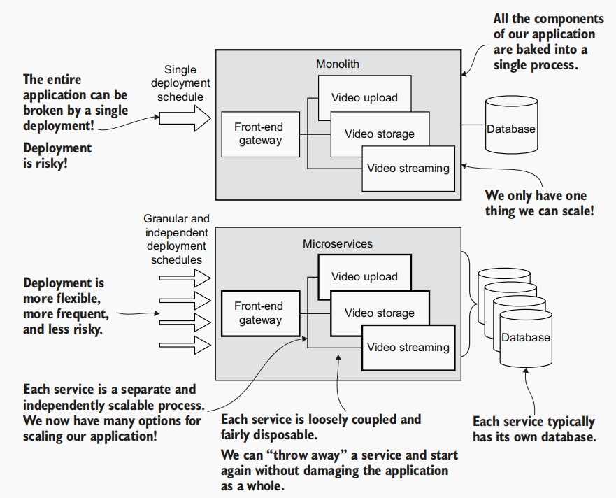
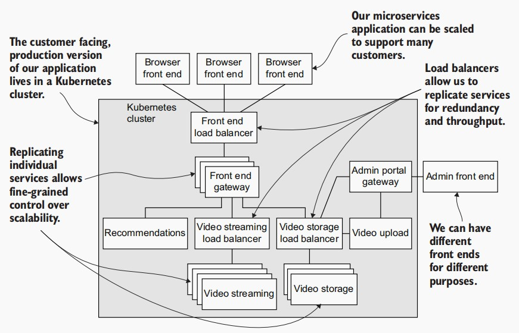

# Bootstrapping Microservices with Docker, Kubernetes, and Terraform
After reading this book and practicing the skills taught, you
can expect to be able to
- Create individual microservices
- Package and publish microservices using Docker
- Develop a microservices application on your development workstation using
Docker Compose
- Test your code, microservices, and application using Jest and Cypress
- Integrate third-party servers into your application (like MongoDB and RabbitMQ,
as examples)
- Communicate between microservices using HTTP and RabbitMQ messages
- Store the data and files your microservices need to operate
- Create production infrastructure with Kubernetes using Terraform
- Deploy your microservices to production using Terraform
- Create a continuous delivery pipeline to automatically deploy your application
as you update the code

## What is a microservice?

> A `microservice` is a tiny and independent software process that runs
on its own deployment schedule and can be updated independently.

##  What is a microservices application?

> A `microservices application` is a distributed program composed of
many tiny services that collaborate to achieve the features and functionality of
the overall project.

## What’s wrong with the monolith?
> A `monolith` is an entire application that runs in a single process.

### Advantages of monolithic architecture
- Less cross-cutting concerns.
- Seamless debugging and testing.
- Prompt and simple deployment.
- Easier development.

### Disadvantages of monolithic architecture
- Code complexity.
- Highly interdependent components.
- Limited scalability.
- New technology barriers.

### Advantages of microservice architecture
- Independent components.
- Easier maintenance.
- Better scalability.
- Flexibility in choosing the technology.
- Isolation of services.

### Disadvantages of microservice architecture
- Extra complexity.
- System distribution.
- Cross-cutting concerns.
- Difficulties with testing.

## Modern tooling for microservices
- **Docker**—To package and deploy our services
- **Docker Compose**—To test our microservices application on our development workstation
- **Kubernetes**—To host our application in the cloud
- **Terraform**—To build our cloud infrastructure, our Kubernetes cluster, and deploy our application

## An example application
The example product we will build is a video-streaming application name `FlixTube`. Our application will have a browser-based front end so our users can view a list of
videos. From there they can select a video and it will begin playing. During development, we’ll boot our application using Docker Compose, which we’ll cover in chapters
4 and 5. We’ll build and publish Docker images for our microservices in chapter 3. In
chapters 6 and 7, we’ll deploy our application to production. In chapter 8, we’ll swing
back to development for some automated testing.
 Our application will contain services for video streaming, storage, and upload, plus
a gateway for the customer-facing front end. We’ll work up to deploying the full application in chapter 9, which figure illustrates below. In chapters 10 and 11, we’ll look at all
the ways this architecture can help us scale in the future as our application grows. Are
you ready to start building with microservices?

