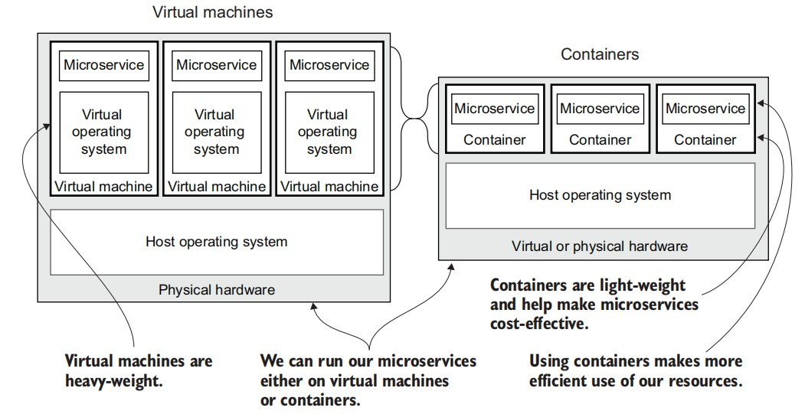
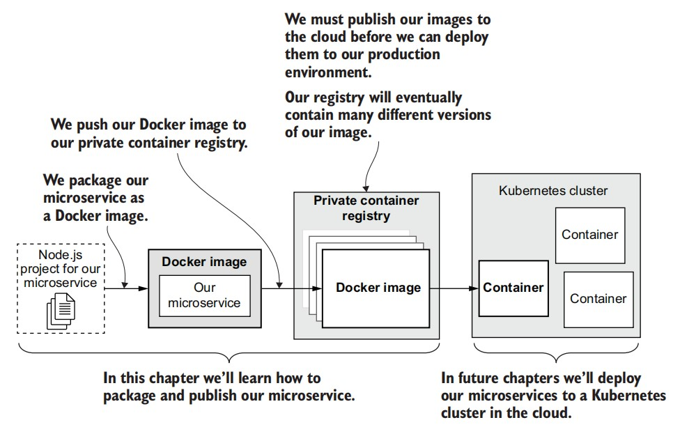
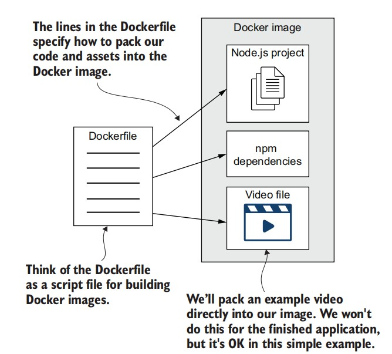
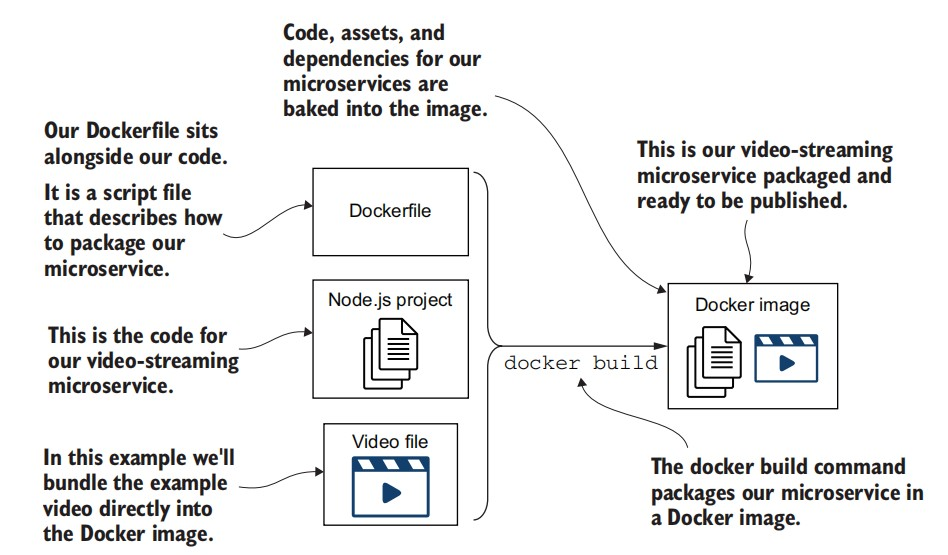

# Publishing your first microservice
## What is a container?
> A `container` is a way of virtualizing a server.



## What is an image?
> An `image` is a bootable snapshot of a server (in our case, a microservice) including all the code, dependencies, and assets that it needs to run.

## What are we doing with Docker?
- Package our microservice into a Docker image
- Publish our image to our private container registry
- Run our microservice in a container



## Packaging our microservice
1. Create a Dockerfile for our microservice
2. Package our microservice as a Docker image
3. Test the published image by booting it as a container

### Creating a Dockerfile
Dockerfile as a script file with instructions on how to construct the image.


A Dockerfile for our video-streaming microservice (Chapter-3/example-1/Dockerfile)
```
FROM node:12.18.1-alpine    # Alpine is a lightweight Linux distribution that includes only the bare minimum, 
                            # so it is much smaller than a regular distribution

WORKDIR /usr/src/app    # Sets the directory in our image
COPY package*.json ./   # Copies the Node.js package.json file into the image
RUN npm install --only=production   # Installs only the production dependencies using npm
COPY ./src ./src        # Copies the source code for our microservices
COPY ./videos ./videos  # Copies our sample video
CMD npm start           # Starts the microservice using the “npm start”
```
### Packaging and checking our Docker image
We’ll build the image using the docker build command. It takes as input our Dockerfile, which contains the instructions to build the image.

```
cd Chapter-3/example-1
docker build -t video-streaming --file Dockerfile .
```


```
docker images
>> REPOSITORY                    TAG       IMAGE ID       CREATED         SIZE
   video-streaming               latest    c2102467548e   2 minutes ago   92.9MB
```

###  Booting our microservice in a container
We can use the docker run command to instantiate it as a container.
```
docker run -d -p 3000:3000 video-streaming
>> 6f095eca61da3cdc200656b03c2f601416a927723cc7de199132b25cac9d3f44  # ID for container printed
```

- The `-d` argument causes our container to run in detached mode. 
- The `-p` argument binds the port between the host operating system and our container.
- The `video-streaming`, is the name we gave our image.The last argument, video-streaming, is the name we gave our image.

Check container
```
docker ps -a
>> CONTAINER ID   IMAGE             ...   CREATED         STATUS                       PORTS    
   6f095eca61da   video-streaming   ...   3 minutes ago   Up 3 minutes   0.0.0.0:3000->3000/tcp, 

docker logs 6f095eca61da
> example-1@1.0.0 start /usr/src/app
> node ./src/index.js

Microservice listening on port 3000, point your browser at http://localhost:3000/video
```

##  Publishing our microservice
We have packaged it in a Docker image, but currently, that image resides locally on
our development workstation. That’s great for our own testing and experimentation,
but we still need to have our image published somewhere, so that we can later deploy it to our Kubernetes cluster.

We’ll publish our microservice with the following steps:
1. We create our own private container registry on AWS.
2. Before publishing, we must authenticate with the registry using the `aws ecr get-login-password` command.
3. We use the `docker push` command to upload our image to the registry. (This is
the step that actually publishes our microservice.)
4. We use `docker run` again to check that we can boot our microservice from the
published image.

###  Creating a private container registry

###  Pushing our microservice to the registry
- Authenticate your Docker client to the Amazon ECR registry
    ```
    aws ecr get-login-password --region <region> | docker login --username AWS --password-stdin <aws_account_id>.dkr.ecr.<region>.amazonaws.com
    ```
    Replace `<region>` and `<aws_account_id>` by your information

- Tag your image with the Amazon ECR registry
    ```
    docker tag video-streaming:latest <aws_account_id>.dkr.ecr.<region>.amazonaws.com/video-streaming:latest
    ```

- Push the image using the docker push command
    ```
    docker push <aws_account_id>.dkr.ecr.<region>.amazonaws.com/video-streaming:latest
    ```

### Running a container from the registry
```
docker run -d -p 3000:3000 183139400842.dkr.ecr.ap-southeast-1.amazonaws.com/video-streaming:latest
```
Clean the mess
```
docker ps -a
docker stop f5e0c19e8b01
docker rm f5e0c19e8b01
docker rmi 183139400842.dkr.ecr.ap-southeast-1.amazonaws.com/video-streaming:latest
```