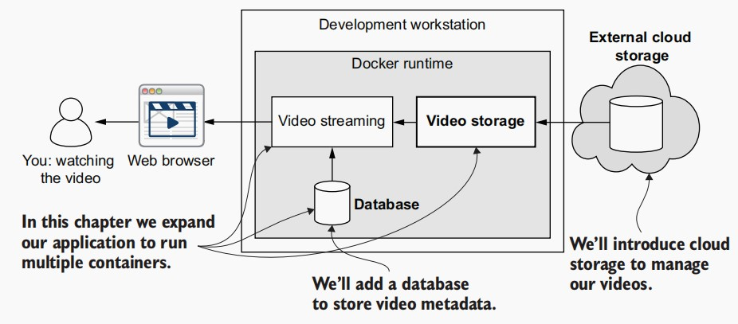

# Data management for microservices
In this chapter, we add both *file storage* and a *database* to our FlixTube example
application. First, we’ll add file storage so FlixTube has a location to store its videos.
We want to have distinct areas of responsibility in our application for streaming and
video storage. That implies that we’ll need to add another microservice to our
application, and in this chapter, we will indeed create our second microservice. 

Then we’ll add a database. At this point, we add a database so that we have a place
to record the path to each video, but this is really just an excuse to get a database in place. Because once we have it, we can easily use it to store all the metadata for our videos
and to provide for the on-going data storage needs of all our microservices.

## New tools

|Tool | Version | Purpose|
|-------|--------|------------|
|Docker | Compose 1.26.2 |Docker Compose allows us to configure, build, run, and managemultiple containers at the same time.|
|S3 | AWS SDK| Amazon S3 is a service to store files in the cloud. We can manage the assets through the AWS CLI, through the APIs, or from the command line. We’ll upload a video through the AWS CLI and then use the Node.js AWS SDK to read it back.|
|MongoDB | 4.2.8 | MongoDB is a popular NoSQL type of database. It’s lightweight, easy to setup and use, and it’s convenient for microservices.|

## Developing microservices with Docker Compose
 We are scaling up to multiple containers in this chapter because we’d like to add a
database (that’s one container), and we’d also like to add a new microservice to handle our file storage (that’s another container). We’ll have three containers as depicted in figure:


### Why Docker Compose? 
In the same way that Docker allows us to build, run, and
manage a single microservice, Docker Compose gives us a convenient way to build,
run, and manage multiple microservices in development.

### Creating our Docker Compose file
> The `Docker Compose file` is a script that specifies how to compose an application from multiple Docker containers.

Docker Compose file for our microservice (chapter-4/example-1/docker-compose.yml)
```
version: '3'
services:                               # Nests our containers under the “services” field

  video-streaming:
    image: video-streaming              # Sets the name of the image 
    build: 
      context: ./video-streaming        # Sets the directory for the microservice
      dockerfile: Dockerfile
    container_name: video-streaming     # Names the container that’s instantiated
    ports:
     - "4000:80"        # Maps port 80 in the microservice to port 4000 on the host’s operating system
    environment:
      - PORT=80         # Sets environment variables to configure input to the container
    restart: "no"       # If the microservice crashes, don’t automatically restart it
```

### Booting our microservices application
We’ll use the Docker Compose file we just created so we can boot up our application
using Docker Compose.

```
$ cd chapter-4/example-1
$ docker-compose up --build
```

That’s only a small savings in time right now, but as you’ll soon see, the Docker
Compose up command is scalable to many containers. You can imagine how much
time it’s going to save when you have, say, 10 microservices and you can use a single up
command to build and run all of these at once!

###  Working with the application
Even though our terminal is locked up with Docker Compose, we can always simply
open a new terminal and use it to invoke other commands. Let’s try that now.
```
$ docker-compose ps
Name                    Command               State                  Ports                
-----------------------------------------------------------------------------------------------
video-streaming   docker-entrypoint.sh /bin/ ...   Up      0.0.0.0:4000->80/tcp,:::4000->80/tcp
```

### Shutting down the application
```
$ docker-compose stop
```

Right now, though, it’s more useful that we can remove our containers
and return our development workstation to a clean state. For that, we can use the down
command:
```
$ docker-compose down
```

We can use both the up and down commands in combination to easily reboot our
application when we want to get updated code or dependencies into it. We can chain
these commands as follows:
```
$ docker-compose down && docker-compose up --build
```

###  Can we use Docker Compose for production?
At this point, we might pause to consider why we are using *Docker Compose* for development but not for production. *Docker Compose seems* like a great way to define a
microservices application, so why can’t we use it in production? Why would we choose
to use *Kubernetes* instead?

Rolling your own *Docker Compose* stack for production is **easy at the outset** but
**difficult to scale**. You could deploy to Docker Swarm, but then that locks you into that
particular platform. Kubernetes is a robust and flexible platform for running microservices in production.

## Adding file storage to our application
### Using AWS S3
1. Create S3 buckets
2. Upload video `SampleVideo_1280x720_1mb.mp4` to S3 buckets
3. [Create a shared configurations file with your user credentials](https://docs.aws.amazon.com/sdk-for-javascript/v2/developer-guide/loading-node-credentials-shared.html)
4. Create a microservice to read S3 storage
  - install aws-sdk
    ```
    npm install aws-sdk
    ```
  - Test new microservice
    ```
    export PORT=3000
    npm start
    ```

With your microservice running, you can now open your browser and navigate to
http://localhost:3000/video?path=SampleVideo_1280x720_1mb.mp4. If you used a
different name for your video, you’ll need to adjust the name of that video in this URL
to fit. You should now see the familiar video playing, but this time, it’s streamed from
your AWS S3 account.

### Updating the video-streaming microservice
Here we update our video-streaming microservice to delegate storage to another
microservice. We are separating our concerns so that the video-streaming microservice is
solely responsible for streaming video to our user and so that it doesn’t need to know
the details of how storage is handled.

> Updated video-streaming microservice (chapter-4/example-2/video-streaming/src/index.js)
```
const express = require("express");
const http = require("http");         // Loads the http library so we can forward HTTP requests

const app = express();

// Configures the connection to the video-storage microservice
const PORT = process.env.PORT;
const VIDEO_STORAGE_HOST = process.env.VIDEO_STORAGE_HOST;
const VIDEO_STORAGE_PORT = parseInt(process.env.VIDEO_STORAGE_PORT);
console.log(`Forwarding video requests to ${VIDEO_STORAGE_HOST}:${VIDEO_STORAGE_PORT}.`);

app.get("/video", (req, res) => {
    const forwardRequest = http.request( // Forward the request to the video storage microservice.
        {
            // Sets the host and port we are forwarding to
            host: VIDEO_STORAGE_HOST,
            port: VIDEO_STORAGE_PORT,
            path: '/video?path=SampleVideo_1280x720_1mb.mp4', // Video path is hard-coded for the moment.
            method: 'GET',
            // Forwarding the HTTP headers as they are
            headers: req.headers
        }, 
        forwardResponse => {
            res.writeHeader(forwardResponse.statusCode, forwardResponse.headers);
            forwardResponse.pipe(res);
        }
    );
    
    req.pipe(forwardRequest);
});

app.listen(PORT, () => {
    console.log(`Microservice online`);
});
```

### Adding our new microservice to the Docker Compose file
To integrate the new microservice into our application and test it, we now must add it
as a new section to our Docker Compose file.

You can think of the Docker Compose file as a kind of *aggregate* Dockerfile that we use
to describe and manage multiple containers at once. It’s an aggregate because we use
it to tie together the multiple Dockerfiles for each of our microservices.

>  Adding a new microservice to our Docker Compose file (chapter-4/example-2/docker-compose.yaml)
```
version: '3'
services:

  azure-storage:
    image: aws-s3
    build: 
      context: ./aws-s3
      dockerfile: Dockerfile
    container_name: video-storage
    ports:
     - "4000:80"
    # Configures the microservice to connect to our AWS S3 account. 
    # Make sure you add your own details here.
    environment:
      - PORT=80
      - ACCESS_KEY_ID=<your key ID>
      - STORAGE_ACCESS_KEY=<your storage access key>
    restart: "no"

  video-streaming:
    image: video-streaming
    build: 
      context: ./video-streaming
      dockerfile: Dockerfile
    container_name: video-streaming
    ports:
     - "4001:80"
    # Configures the microservice to connect to the video-storage microservice
    environment:
      - PORT=80
      - VIDEO_STORAGE_HOST=video-storage  # The container’s name connects these two microservices!
      - VIDEO_STORAGE_PORT=80
    restart: "no"
```

### Testing the updated application
Now we are finally ready to boot our application and test it with our additional microservice.
```
$ docker-compose up --build

video-streaming | > example-1@1.0.0 start /usr/src/app
video-streaming | > node ./src/index.js
video-streaming |
video-storage |
video-storage | > example-1@1.0.0 start /usr/src/app
video-storage | > node ./src/index.js
video-storage |
video-streaming | Forwarding video requests to video-storage:80.
video-streaming | Microservice online.
video-storage | Serving videos from... 
video-storage | Microservice online.
```

Let’s navigate our browser to http://localhost:4000/video?path=SampleVideo_1280x720_1mb.mp4 and test the
video-storage microservice.

###  Cloud storage vs. cluster 
We used cloud storage instead of cluster storage because it’s simple, it works when
we run in development, it’s cheap, and it’s managed for us. These are the benefits of
cloud storage and why it’s in common use by many companies. Besides, we haven’t
learned anything about Kubernetes yet, so we definitely couldn’t have used Kubernetes volumes at this point in the book.