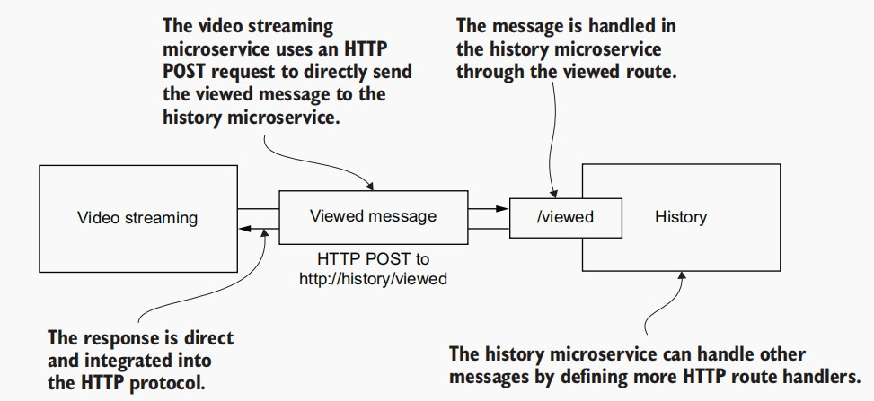

# Communication between microservices

## New and familiar tools
This chapter introduces the RabbitMQ software for queuing messages. This will help
us decouple our microservices. We’ll use the npm package, amqplib, to connect our
microservices to RabbitMQ so these can send and receive messages.

|Tool|Version|Purpose|
|---|---|---|
|Docker Compose|1.26.2|ker Compose lets you configure, build, run, and manage multiple containers at the same time.|
|HTTP|1.1 | Hypertext Transfer Protocol (HTTP) is used to send direct (or synchronous messages from one microservice to another.|
|RabbitMQ|3.8.5 | RabbitMQ is the message queuing software that we’ll use to send indirect (or asynchronous) messages from one microservice to another.|
|amqplib |0.5.6 |This npm package allows us to configure RabbitMQ and to send and receive  messages from JavaScript.|

## Getting our microservices talking
In this chapter, we add a third microservice to our application: the history microservice. The purpose of adding this new microservice is to demonstrate communication
among microservices. You can see in figure below how the video-streaming microservice
is sending a stream of messages to the history microservice.


## Introducing the history microservice
We are using the history microservices in this chapter as an example of how microservices can send and receive messages to each other. Actually, this new microservice
really does have a proper place in FlixTube, and as the name suggests, it records our
user’s viewing history.

To keep the examples in this chapter simple, we’ll drop out the video-storage
microservice from the last chapter, which simplifies the video-streaming microservice.
In fact, for our starting point in this chapter, we’ll revert back to an earlier version of
the video-streaming microservice that has the example video baked into its Docker
image.


The message we’ll transmit between microservices is the viewed message. This is
how the video-streaming microservice informs the history microservice that the user
has watched a video.

## Live reload for fast iterations
In this section, we’ll upgrade our Docker Compose file to support sharing code
between our development workstation and our containers.


we’ll use nodemon for this, and we’ll use it across the board for all our
microservices. It automatically restarts each microservice when the code changes.

###  Creating a stub for the history microservice
We’ll create the live reload configuration only for the new history microservice, but
after that, we’ll need to apply this same configuration to each and every microservice.

This doesn’t do anything yet. It’s just a stub and is waiting to have features added. Once we have live reload working for this microservice, we’ll be able to boot our application using Docker Compose. Then, we’ll make live
updates and incremental changes to evolve this new microservice without having to
restart the application.

> Listing 5.1 A stub for the history microservice (chapter-5/example-1/history/src/index.js)
```
const express = require("express");
function setupHandlers(app) {   // This is a stub microservice. Later, we’ll add HTTP routes
                                // and message handlers here!
}

...
```

### Augmenting the microservice for live reload
The npm package, nodemon, is what we’ll use to watch our code and to automatically
restart our microservice when the code changes.
```
$ npm install --save-dev nodemon
```
With the start:dev npm script in place, we can run our microservice like this:
```
$ npm run start:dev
// This invokes nodemon for our microservice like this:
$ nodemon --legacy-watch ./src/index.js
```
### Splitting our Dockerfile for development and production
For all microservices, henceforth, we’ll create not just one but two Dockerfiles. We
now need one for development and another for production. We’ll call the development one Dockerfile-dev and the production one Dockerfile-prod.

> Creating the production Dockerfile (chapter-5/example-1/history/Dockerfile-prod)
```
FROM node:12.18.1-alpine
WORKDIR /usr/src/app
COPY package*.json ./
RUN npm install --only=production 
COPY ./src ./src                    // Copies the source code into the image
CMD npm start                       // Starts the microservice in production mode
```

> Creating the dev Dockerfile (chapter-5/example-1/history/Dockerfile-dev)
```
FROM node:12.18.1-alpine
WORKDIR /usr/src/app
COPY package*.json ./                           // Copies the package.json file into the image.
CMD npm config set cache-min 9999999 && \       // Enables caching for npm installs, making subsequent npm installs faster
    npm install && \ 
    npm run start:dev           // Starts the microservice in development mode, using nodemon for live reload
```

### Updating the Docker Compose file for live reload
> Updating the Docker Compose file for live reload (extract from chapter-5/example-1/docker-compose.yaml)
```
version: '3'
services:

  # ... other services defined here ...

  history:
    image: history
    build: 
      context: ./history
      dockerfile: Dockerfile-dev
    container_name: history

    # Defines volumes that are shared between the host operating system and the container
    volumes:
      - /tmp/history/npm-cache:/root/.npm:z     # Shares the npm cache from the host to the container
      - ./history/src:/usr/src/app/src:z        # Shares the source code directly from the host to the container.
    ports:
      - "4001:80"
    environment:
      - PORT=80
      - NODE_ENV=development
    restart: "no"
```

The next thing that is new is the addition of the `volumes` field, where we create
some Docker volumes to connect the filesystem on our development workstation with
the filesystem of the container. This links our source code directly into the container.
It’s the reason why we didn’t bake our code directly into the image.

### Trying out live reload
Then use Docker Compose to start the application:
```
$ docker-compose up --build
...
video-streaming    | Microservice online.
history            | Hello world!
history            | Microservice online.
```

This example contains the simplified video-streaming microservice and the new stub
history microservice. Check the output from Docker Compose. You should see “Hello
world!” printed out by the stub history microservice as it starts up. To test live reload,
we’ll change the message that is printed by the history microservice:
1. Open the example-1 directory in VS Code. 
2. Find and open the index.js file for the history microservice. 
3. Search for the line of code that prints the `Hello world!` message and change this line of code to print `Hello computer!` instead. 
4. Save the index.js file and then switch back to the Docker Compose output.

When you invoke Docker Compose, you can use the `-f` argument to specify the
Docker Compose file. For instance, if you want to run your application in production
mode on your development workstation, you might like to create a separate *production*
version of your Docker Compose file and run it like this:
```
$ docker-compose -f docker-compose-prod.yml up --build
```

##  Methods of communication for microservices
But before we dive into the
technology for communication, we’ll start with a high-level overview of the two styles
of communication used by microservices: direct messaging and indirect messaging,
also commonly known as `synchronous` and `asynchronous` communication.

### Direct messaging
Direct messaging simply means that one microservice directly sends a message to
another microservice and then receives an immediate and direct response. Direct
messaging is used when we’d like one microservice to directly message a particular
microservice and immediately invoke an action or task within it.


### Indirect messaging
Indirect messaging introduces an intermediary between the endpoints in the communication process. We add a middleman to sit between our microservices. For that reason,
the two parties of the communication don’t actually have to know about each other.
- *Messages are sent via an intermediary so that both sender and receiver of the messages don’t know which other microservice is involved*. In the case of the sender, it doesn’t
even know if any other microservice will receive the message at all!
- *Because the receiver doesn’t know which microservice has sent the message, it can’t send a direct reply*. This means that this style of communication can’t be applied in situations where a direct response is required for confirming success or failure.


## Direct messaging with HTTP
In the previous chapter, we used HTTP for data retrieval, which retrieved our streaming video from storage. In this chapter, we use HTTP for a different purpose: sending
direct messages from one microservice to another.


