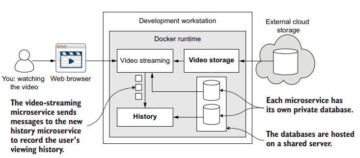
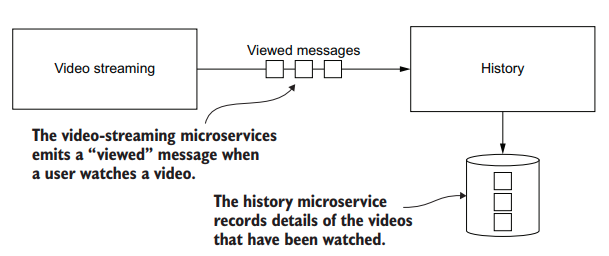
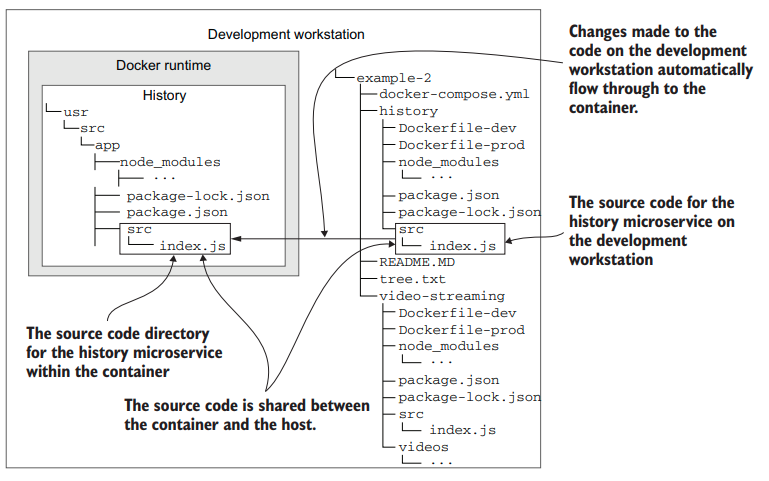

# Communication between microservices

## New and familiar tools
This chapter introduces the RabbitMQ software for queuing messages. This will help
us decouple our microservices. We’ll use the npm package, amqplib, to connect our
microservices to RabbitMQ so these can send and receive messages.

|Tool|Version|Purpose|
|---|---|---|
|Docker Compose|1.26.2|ker Compose lets you configure, build, run, and manage multiple containers at the same time.|
|HTTP|1.1 | Hypertext Transfer Protocol (HTTP) is used to send direct (or synchronous messages from one microservice to another.|
|RabbitMQ|3.8.5 | RabbitMQ is the message queuing software that we’ll use to send indirect (or asynchronous) messages from one microservice to another.|
|amqplib |0.5.6 |This npm package allows us to configure RabbitMQ and to send and receive  messages from JavaScript.|

## Getting our microservices talking
In this chapter, we add a third microservice to our application: the history microservice. The purpose of adding this new microservice is to demonstrate communication
among microservices. You can see in figure below how the video-streaming microservice
is sending a stream of messages to the history microservice.

## Introducing the history microservice
We are using the history microservices in this chapter as an example of how microservices can send and receive messages to each other. Actually, this new microservice
really does have a proper place in FlixTube, and as the name suggests, it records our
user’s viewing history.

To keep the examples in this chapter simple, we’ll drop out the video-storage
microservice from the last chapter, which simplifies the video-streaming microservice.
In fact, for our starting point in this chapter, we’ll revert back to an earlier version of
the video-streaming microservice that has the example video baked into its Docker
image.

The message we’ll transmit between microservices is the viewed message. This is
how the video-streaming microservice informs the history microservice that the user
has watched a video.

## Live reload for fast iterations
In this section, we’ll upgrade our Docker Compose file to support sharing code
between our development workstation and our containers.

we’ll use nodemon for this, and we’ll use it across the board for all our
microservices. It automatically restarts each microservice when the code changes.

###  Creating a stub for the history microservice

